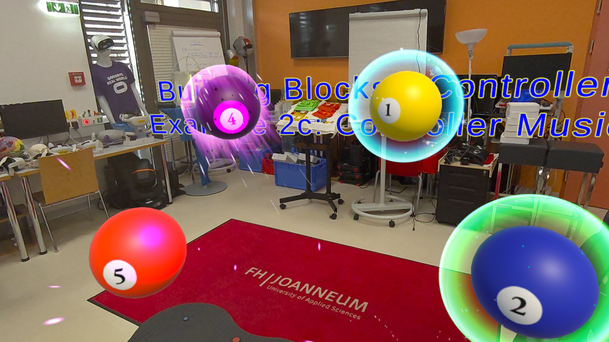
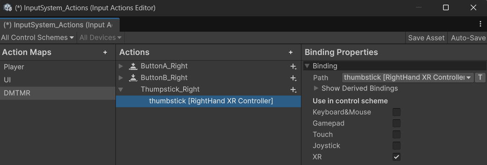

# MixedReality_DevUnity with Meta  Quest3 & Unity & C#

MixedReality devlopment @ FH JOANNEUM, Nischelwitzer 



# Building Blocks Examples

* Camera Rig
* Passthrough
* Controller Tracking
* Hand Tracking

## Controller Interface with Building Blocks

* Building Block: Controller Tracking
* Building Block: Controller Button Mapper
* Add On BBlock: Haptic
  


* Step 1: Input Actions
* Way 1: Controller Button Mapper (Building Block) 
  * CallBack Function (Events) 
* Way 2: Player Input (Script)
  * Own Script with Event: https://github.com/nischelwitzer/MixedReality_DevUnity/blob/main/scripts/controller/ControllerEventHandler.cs

## Scenes with Mixed Reality Utility Kit (MRUK)

* https://developers.meta.com/horizon/documentation/unity/unity-mr-utility-kit-overview/
* MRUK > Core > Tools > Effect Mesh (Room Box Effects)
* World Locking
* Passthrough & use scene (android manifest) 

## Hands and Fingers

```
foreach (var bone in skeleton.Bones)
```

## Controller Events

* Player Wrapper

## PCA Passthrough Camera Api

* Check: https://github.com/xrdevrob

## Links and Infos

* https://github.com/dilmerv/com.learnxr.core.git (Logger3D) Add package from git URL
* https://www.youtube.com/@ValemTutorials 
