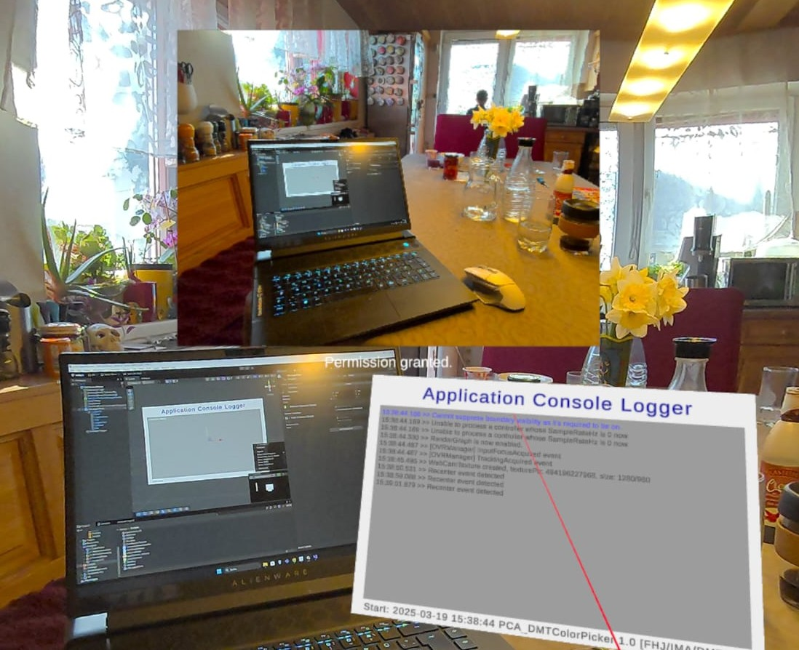

# MixedReality Logger

- 🙌 Based on LearnXR.Core.Utilities Dilmer Valecillos https://learnxr.com
- 🎬 Script: SpatialLogger.cs fills the TMP Text
- 🎬 Script: Look2Camera.cs rotate to MR Camera and Mirror-Flag
- 🎬 Script: InfoLineWriter.cs fills the base line with App Infos
- 👨‍🏫 included in the Unity-QuestVisionKit ()



## Billboard Rotation

👥 rotates the billboard (canvas) to the HMD User

```
this.transform.LookAt(referencePos.position);
```

## Info Line

👥 writes AppInfos to the Debug Canvas

```
infoLine.text = "Start: " + DateTime.Now.ToString("dd-MM-yyyy HH:mm ") + Application.productName + " V" + Application.version";
```


📫 Contact: nischelwitzer@gmail.com 
